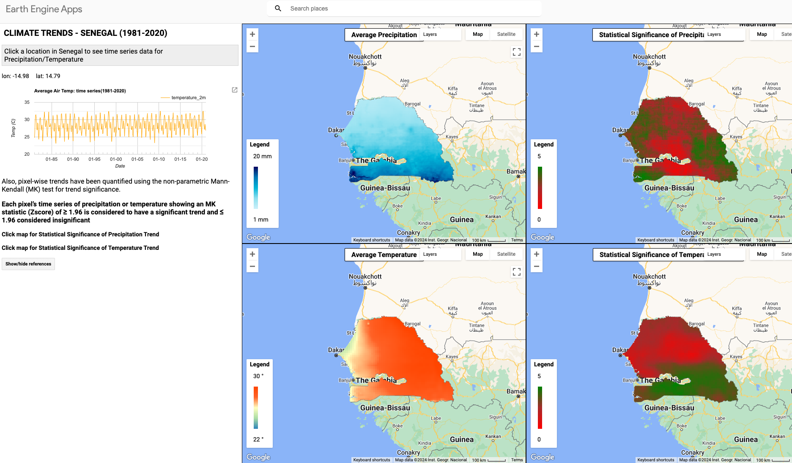

# Climate-Trend-Analysis
This repository houses scripts that can be used to run a climate trend analysis in Google Earth Engine


**Prerequisites:**
- [ ] [Select an appropriate data source according to literature for eg. CHIRPS, ERA5, MODIS etc.](#generating-a-project-)
- [ ] [Basic Javascript knowledge](#adding-data-)
- [ ] [Basic GEE knowledge](#adding-data-)

# Generating trends in GEE

### To generate temperature trends use the following [[script]](https://code.earthengine.google.com/0349a7632327e3544eff4a1f93adfa67)
```bash
//import country boundary
var dataset = ee.FeatureCollection("USDOS/LSIB_SIMPLE/2017")


//Filter the country boundary to study area
var kenya = dataset.filter(ee.Filter.eq('country_na', 'Kenya')) //can change this to whatever region of interest
Map.centerObject(kenya,6)

//Map.addLayer(dataset,{}, 'World Country')
Map.addLayer(kenya,{}, 'Kenya')

// #############################################################################

//Load data collection
var dataset = ee.ImageCollection("ECMWF/ERA5_LAND/MONTHLY_AGGR")
.select('temperature_2m')

// Scale to Kelvin and convert to Celsius, set image acquisition time.
var dataset_convert = dataset.map(function(img) {
  return img
    .subtract(273.15)
    .copyProperties(img, ['system:time_start']);
});

//define date range of interest 
var Era5_TREND = dataset_convert.filterDate('1981-01-01','2023-12-31');

var MeanAirTemp = Era5_TREND.mean()

//Chart the full time series for your AOI
var TS1 = ui.Chart.image.series (Era5_TREND, kenya, ee.Reducer.mean(),1000,'system:time_start').setOptions({
  title:'Average LST from 1981-2023(ERA5)', 
  vAxis: {title: '°C'}, });

print(TS1);

var tempVisParams = {
  min:15,
  max:30,
  palette: ['2b83ba','abdda4','ffffbf', 'ff6227', 'ff4500']
}
Map.addLayer(MeanAirTemp.clip(kenya), tempVisParams, 'Mean AirTemp 1981-2023')
```

### To generate precipitation trends use the following [[script]](https://code.earthengine.google.com/8c7f92b47009c0bf9707ed040aebd368)
```bash
//import country boundary
var dataset = ee.FeatureCollection("USDOS/LSIB_SIMPLE/2017")

//Filter the country boundary to study area
var kenya = dataset.filter(ee.Filter.eq('country_na', 'Kenya'))
Map.centerObject(kenya,6)


// #############################################################################

//Load data collection
var CHIRPS = ee.ImageCollection( 'UCSB-CHG/CHIRPS/PENTAD');

//define date range of interest "Senegal"
var precip = CHIRPS.filterDate('1981-01-01','2023-12-31')
.filter(ee.Filter.calendarRange(1, 12, 'month'))

//Chart the full time series for Senegal region
var TS5 = ui.Chart.image.series (precip, kenya, ee.Reducer.mean(),1000,'system:time_start').setOptions({
  title:'Average Precipitation from 1981-2023', 
  vAxis: {title: 'mm/pentad'}, });

print(TS5);

// //Chart a single year //this has been commented out, however can be run if you want to analyze trends for a single year
// var precip1year = CHIRPS.filterDate('2020-01-01','2020-12-31');
// var TS1 = ui.Chart.image.series (precip1year, kenya, ee.Reducer.mean(),1000, 'system:time_start').setOptions({
// title: 'Average Precipitation for 2020',
// vAxis: {title: 'mm/pentad'}, });

// print (TS1);

//visualizing the results
var vis = {
  min: 0,
  max: 20,
  palette:['caf0f8','ade8f4','90e0ef','48cae4','00b4d8', '0096c7', '0077b6', '023e8a', '03045e']
};

//Map your result spatially
//var yearPrecip = precip1year.mean().clip(kenya);
var meanPrecip = precip.mean().clip (kenya);

//Map.addLayer(yearPrecip, vis,'Mean Precipitation for 2020');

Map.addLayer (meanPrecip, vis, 'Mean Precipitation 1981 - 2023');
```

### To  quantify  trends  in  each  pixel  using  the  non-parametric  Mann-Kendall  test  for trend  significance  and  Sen’s  slope  estimator  for  magnitude resort to this [[script]](https://code.earthengine.google.com/c141f45513e9ce5729868092edce46ed)
```bash
//Load data collection (For other datasets such as ERA5 - Do well to convert from Kelvin to celsius when processing
the data for temperature)
var dataCollection = ee.ImageCollection('UCSB-CHG/CHIRPS/PENTAD') 
    .select(['precipitation'])

// Import country boundaries feature collection.
var dataset = ee.FeatureCollection('USDOS/LSIB_SIMPLE/2017');

// Apply filter where country name equals Uganda.
var senegal = dataset.filter(ee.Filter.eq('country_na', 'Senegal'));


// Add Uganda outline to the Map as a layer.
Map.centerObject(senegal, 6);

var eps = 1e-6;

// time series
var annualmax = ee.List.sequence(1981, 2020).map(
    function (year) {
        // map the time series into monthly means (for season calculation, change months here according to season)
        return ee.ImageCollection(
            ee.List.sequence(1, 12).map(//Monsoon: 6,7,8,9/ post-monsoon: 10,11/ winter: 12,2,1/ pre-monsoon: 3,4,5
                function (month) {
                    var date = ee.Date.fromYMD(year, month, 1);
                    // mean chlor_a (log-normal)
                    var monthMeanImage = dataCollection.filterDate(date, date.advance(12, 'month')).sum().rename('precipitation');

                    // add time band
                    date = ee.Image(date
                        .difference('2001-01-01', "year"))
                        .double()
                        .rename("time");
                    return date.addBands(monthMeanImage);
                })).max().set('system:time_start', ee.Date.fromYMD(year, 1, 1));
    });
print(annualmax);

// test trend with Sen's slope
var senslope = ee.ImageCollection(annualmax)
    .reduce(ee.Reducer.sensSlope());

//  create ones image
var ones = ee.Image(1);
//  create zeros image
var zeros = ee.Image(0);

// Computation of the mean E[S] for the Mann-Kendall test
var mkMean = ee.ImageCollection(ee.List.sequence(0,
    // i = 0, n - 1
    annualmax.length().subtract(2)).map(
        function (xi) {
            // for each image xi subtract another xj. Applied for the external sum
            return ee.ImageCollection.fromImages(
                ee.List.sequence(ee.Number(xi).add(1),
                    // j = i + 1, n
                    annualmax.length().subtract(1)).map(
                        function (xj) {
                            // Applied for the internal sum where the signum function is computed
                            var diff_ij = ee.Image(annualmax.get(xj)).select('precipitation')
                                .subtract(ee.Image(annualmax.get(xi)).select('precipitation'));

                            // absolute diff should be larger than the precision to be 
                            // considered larger or smaller than zero
                            var diff = diff_ij.where(diff_ij.abs().lt(eps), zeros);

                            // replace positives and negatives with ones and -ones
                            return diff.where(diff.gt(0), ones)
                                .where(diff.lt(0), ones.multiply(-1)).rename('ES');
                        })).sum();
        })).sum();

// Variance computation ignoring tied groups                                                        
/////////////////////////////////////////////////////////////////////////////////////////////////
var n = ee.ImageCollection(annualmax)
    .reduce('count')
    .select('precipitation_count')
    .rename('count');
print(n);
// variance
// var(S) = (n * (n - 1) * (2 * n + 5) + ∑(k=1 to p) (tp * (tp - 1) * (2 * tp + 5))) / 18
var varS = n.multiply(
    n.subtract(1).multiply(
        n.multiply(2).add(5)))
    .divide(18).rename('varS');

// Estimation of the z statist (normalised test statistic)
var mkz = mkMean.where(mkMean.abs().lt(eps), 0);
var zscore = mkz
    .where(mkz.gt(eps), mkz.subtract(1).divide(varS.sqrt()))
    .where(mkz.lt(-eps), mkz.add(1).divide(varS.sqrt())).rename('zscore');

// 100(1 - alpha)% two-sided confidence intervals for the Sen's slope.
// The values of Z[1 - alpha / 2] are obtained from the standard normal table. 
// Case alpha = 0.05: Z[1 - alpha / 2] = Z[0.975] = 1.960

var signif = senslope.select(0).lt(0).and(zscore.abs().gte(1.960)).rename('signif');
var sigIncrease = senslope.select(0).gt(0).and(zscore.abs().gte(1.960)).rename('increase');

signif.updateMask(signif);
sigIncrease.updateMask(sigIncrease);

signif = signif.multiply(-1).add(sigIncrease);

// For the Sen slope
var slopeVis = {
    bands: ['slope'],
    min: -0.30,
    max: 0.30,
    palette: 'caf0f8,ade8f4,90e0ef,48cae4,00b4d8, 0096c7, 0077b6, 023e8a, 03045e'
}; 

// For the Sen slope
var sigVis = {
    bands: ['signif'],
    min: -1,
    max: 1,
    palette: 'caf0f8,ade8f4,90e0ef,48cae4,00b4d8, 0096c7, 0077b6, 023e8a, 03045e'
};

// For the Sen slope
var zVis = {
    bands: ['zscore'],
    min: -1,
    max: 3,
    palette: 'red,brown,green'
};

var clippedslope = senslope.clip(senegal)
var clippedsignif = signif.clip(senegal)
var clippedzscore = zscore.clip(senegal)
Map.addLayer(clippedzscore,zVis, 'zscore');
Map.addLayer(clippedslope, slopeVis, 'slope');
Map.addLayer(clippedsignif, sigVis, 'significance');//(alpha = <0.05)

//#####################Masking_Slope <1.96 (Insignificant)##################################
//var slope_select = senslope.select('slope')

var significant_zscore = clippedzscore.gte(1.96);
var Insignificant_zscore = clippedzscore.lte(1.96);

var mask_significant_zscore = clippedzscore.updateMask(significant_zscore);
var mask_insignificant_zscore = clippedzscore.updateMask(Insignificant_zscore);

Map.addLayer(mask_significant_zscore, {palette: ['2b83ba']}, 'mask_significant_zscore');
//Map.addLayer(mask_insignificant_zscore.clip(senegal), {palette: ['abdda4']}, 'mask_insignificant_zscore');

// Export the image to an Earth Engine asset.
Export.image.toDrive({   // Sen's slope image
  image: mask_significant_zscore,
  description: 'mask_significant_zscoreAnnual1981-2020precip',
  scale: 500, 
  maxPixels:1000000000000,
  region: senegal
});

//#####################Exporting##################################

Export.image.toDrive({   // Sen's slope image
  image: clippedslope,
  description: 'Pixelwise_Sen_slopeAnnual1981-2020precip',
  scale: 500, 
  maxPixels:1000000000000,
  region: senegal
});

Export.image.toDrive({// for testing the significance level
image:clippedsignif,
description: 'Statistical_SignificanceAnnual1981-2020precip',
scale: 500, 
maxPixels:1000000000000,
region: senegal
});

Export.image.toDrive({   // Zscore
  image: clippedzscore,
  description: 'Pixelwise_ZscoreAnnual1981-2020precip',
  scale: 500, 
  maxPixels:1000000000000,
  region: senegal
});

// var list = ee.List.sequence(5, 10).reverse();
// print(list, 'here')

// var list2 = ee.List.sequence(10, 12);
// print(list2, 'here2')

// var list3 = ee.List.sequence(10, 12).cat(ee.List.sequence(1, 5));
// print(list3, 'here3')

//ee.List.sequence(1, 12).cat(ee.List.sequence(1, 5)).map
```
## Potential Output



Find the live dashboard [[here]](https://diana-botchway-frimpong.users.earthengine.app/view/climate-trends---senegal)


Once all data is extracted and processed, inside GEE it can be exported:
- [ ] For further visualization in ArcGIS Pro or
- [ ] To R, where the Mann-Kendall and Sen’s slope tests can be applied using the ’trend’ package.


# Citation
If you use method in your research, please acknowledge us using the following citation:
```
@article{nakalembe202440,
  title={A 40-Year Remote Sensing Analysis of Spatiotemporal Temperature and Rainfall Patterns in Senegal},
  author={Nakalembe, Catherine and Frimpong, Diana Botchway and Kerner, Hannah Rae and Sarr, Mamadou Adama},
  year={2024},
  publisher={EarthArXiv}
}
